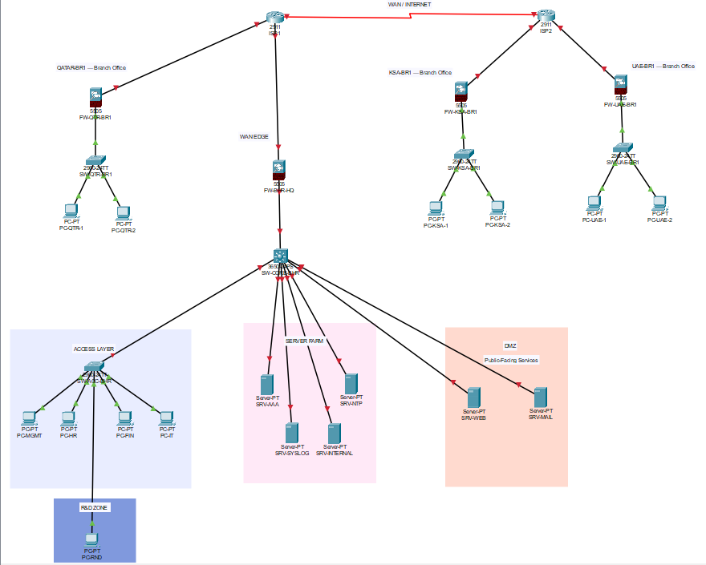
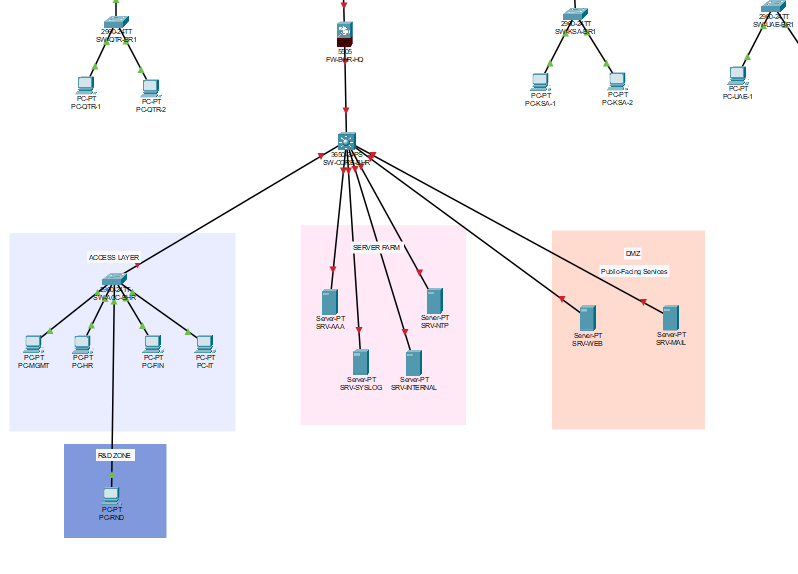
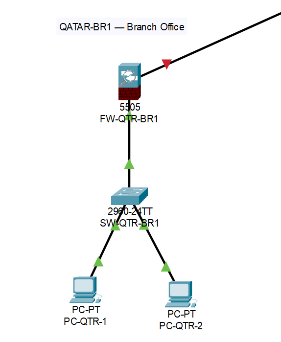

# 🏢 Enterprise Security Infrastructure

## 📖 Overview

This project demonstrates the design and implementation of an enterprise-style security infrastructure using Cisco networking and security technologies within a simulated multi-branch environment. The infrastructure was built to simulate a real-world enterprise network with secure segmentation, centralized routing, branch connectivity, firewall deployment, and layered security controls.

The environment includes a headquarters (HQ), multiple branch offices, VLAN segmentation, inter-VLAN routing, WAN connectivity, DMZ architecture, server infrastructure, and enterprise firewall implementation using Cisco ASA firewalls. Security hardening techniques such as ACL enforcement, Layer 2 security controls, secure administrative access (SSH), port security, BPDU Guard, and broadcast storm mitigation were implemented to strengthen the overall security posture of the environment.

The project also involved practical troubleshooting, routing validation, NAT configuration, firewall deployment, and enterprise security policy enforcement to simulate real-world infrastructure security engineering practices.

---

## 🎯 Objectives

- Design and implement an enterprise-style multi-branch network infrastructure
- Configure VLAN segmentation and inter-VLAN routing
- Implement WAN connectivity between headquarters and branch offices
- Deploy Cisco ASA firewalls for branch and perimeter security
- Implement DMZ and Server Farm network segmentation
- Apply enterprise Layer 2 security hardening techniques
- Configure ACLs to enforce security policies and restrict unauthorized access
- Implement secure remote administrative access using SSH
- Simulate real-world enterprise security architecture and operational practices
- Practice troubleshooting, routing validation, and firewall/NAT configuration

---

## 🏗 Enterprise Architecture

The environment was designed using a centralized enterprise architecture consisting of:

- Headquarters (HQ)
- Qatar Branch
- UAE Branch
- KSA Branch
- WAN backbone connectivity
- Cisco ASA perimeter firewalls
- Core multilayer switching infrastructure
- Dedicated DMZ and Server Farm zones

The HQ acts as the central enterprise hub while branches communicate through routed WAN links and enterprise firewall infrastructure.

### 🌐 Enterprise Topology

#### Full Enterprise Infrastructure

#### Headquarters Infrastructure

#### Qatar Branch Infrastructure

---

## 🌐 Network Segmentation

The infrastructure was segmented using VLANs to isolate departments, infrastructure services, and management systems.

### VLAN Structure

| VLAN | Department / Purpose |
|------|----------------------|
| VLAN 10 | Management |
| VLAN 20 | HR |
| VLAN 30 | Finance |
| VLAN 40 | IT |
| VLAN 50 | R&D |
| VLAN 60 | Server Farm |
| VLAN 70 | DMZ |
| VLAN 99 | Management Native VLAN |

Inter-VLAN routing was implemented using a Cisco multilayer core switch.

---

## 🔗 WAN & Branch Infrastructure

The environment includes enterprise-style WAN connectivity between HQ and multiple branch offices.

### Branch Offices
- Qatar Branch
- UAE Branch
- KSA Branch

### WAN Features
- Static routing
- Branch firewall deployment
- WAN backbone routing
- NAT/PAT configuration
- Multi-site enterprise communication

Cisco ASA firewalls were deployed at branch edges to simulate perimeter security and branch network isolation.

---

## 🛡 Security Features Implemented

### Enterprise Security Controls
- VLAN segmentation
- Inter-VLAN routing
- ACL enforcement
- Department isolation
- Management VLAN protection
- DMZ segmentation
- Server Farm segmentation

### Firewall Security
- Cisco ASA deployment
- NAT/PAT configuration
- Inside/outside security zones
- Static routing
- Branch WAN protection

### Administrative Security
- SSH secure remote management
- Local authentication
- Password encryption
- Security warning banners
- Session timeout configuration

---

## 🔒 Layer 2 Security Hardening

The following Layer 2 security protections were implemented:

- Port Security
- Sticky MAC Addressing
- BPDU Guard
- PortFast
- Disabled unused switch ports
- Broadcast storm mitigation

These controls help reduce unauthorized access, rogue device connections, and Layer 2 attack risks.

---

## 🚧 Firewall & ACL Security Controls

Access Control Lists (ACLs) were implemented to enforce internal enterprise security policies.

### Implemented Security Policies
- R&D VLAN isolation
- Finance VLAN protection
- Management VLAN access restriction
- Department-level traffic filtering
- Segmentation enforcement

These controls help reduce lateral movement and improve internal security governance.

---

## ⚙ Technologies Used

### Networking & Security
- Cisco Packet Tracer
- Cisco ASA Firewalls
- Cisco Multilayer Switches
- VLANs
- ACLs
- NAT/PAT
- Static Routing
- WAN Routing

### Security Hardening
- SSH
- Port Security
- BPDU Guard
- Storm Control
- VLAN Segmentation

---

## 📸 Project Screenshots

Project screenshots include:
- Enterprise topology
- VLAN configuration
- Inter-VLAN routing
- WAN deployment
- Firewall configuration
- ACL enforcement
- SSH hardening
- Layer 2 security hardening
- Enterprise connectivity testing

---

## 🧪 Troubleshooting & Challenges

During implementation, several real-world troubleshooting scenarios were encountered and resolved, including:

- ASA VLAN interface behavior
- NAT/PAT troubleshooting
- ACL placement and filtering logic
- Routing validation issues
- Enterprise WAN reachability troubleshooting
- Packet Tracer ASA limitations and ICMP behavior
- Layer 2 security verification

This project emphasized practical troubleshooting and infrastructure validation throughout deployment.

---

## 💡 Skills Demonstrated

- Enterprise Network Security
- Infrastructure Security
- VLAN Segmentation
- Inter-VLAN Routing
- WAN Routing
- Firewall Deployment
- NAT/PAT Configuration
- ACL Implementation
- Layer 2 Security Hardening
- Network Troubleshooting
- Enterprise Architecture Design
- Security Policy Enforcement
- Secure Administrative Access

---

## 🚀 Future Improvements

Potential future enhancements include:

- Site-to-Site IPsec VPN deployment
- AAA server integration
- Syslog and centralized logging
- DHCP services
- Dynamic routing protocols
- IDS/IPS integration
- SIEM integration
- High Availability (HA) firewall deployment

---

## ⚠ Disclaimer

This project was developed within a simulated lab environment for educational and cybersecurity training purposes. IP addresses, configurations, and network infrastructure shown in this project do not represent production environments.
