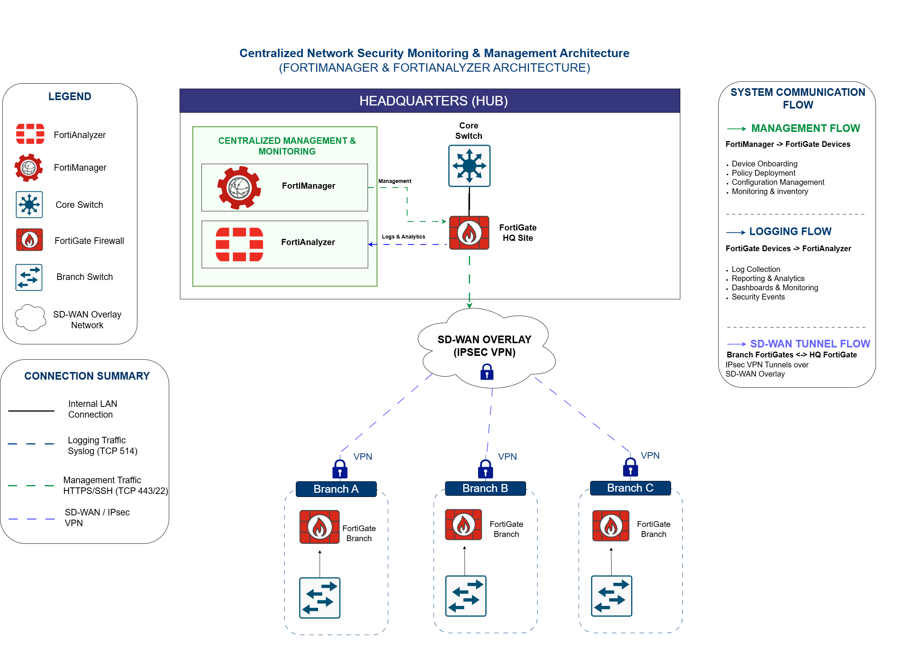

# Centralized Network Security Monitoring & Management Using FortiManager and FortiAnalyzer

## Project Overview

This project demonstrates the implementation of a centralized network security monitoring and management environment using FortiManager and FortiAnalyzer within an enterprise infrastructure.

The solution was implemented during an industry internship within an enterprise Fortinet environment supporting multiple network locations. The project focused on improving network visibility, simplifying security administration, and centralizing monitoring operations through FortiManager and FortiAnalyzer.

FortiManager was utilized for centralized device and policy management, while FortiAnalyzer provided log collection, monitoring, traffic analysis, dashboard visibility, and reporting capabilities. The project focused on the management and monitoring components of the environment rather than the underlying connectivity infrastructure.

The implementation included Administrative Domain (ADOM) management, device onboarding and grouping, policy package administration, firewall object management, provisioning templates, centralized monitoring, log analysis, traffic visibility, dashboard analysis, scheduled reporting, and email notification configuration.

This project provided hands-on experience with enterprise security management workflows and demonstrated how centralized administration and monitoring can improve operational efficiency and security visibility within distributed network environments.

## Architecture

## Problem Statement

Modern organizations often operate across multiple locations and rely on numerous security devices to protect their network infrastructure. As the number of devices increases, managing security policies, monitoring network activity, and analyzing security events can become more complex and time-consuming.

Managing devices individually may lead to inconsistent configurations, reduced visibility into network activity, and increased administrative effort. In addition, security logs generated across multiple devices can become fragmented, making it more difficult for administrators to efficiently monitor traffic, investigate incidents, and identify potential security issues.

To address these challenges, organizations implement centralized management and monitoring platforms that provide a unified view of their security infrastructure. Centralized administration helps improve operational efficiency, maintain configuration consistency, and enhance visibility across the network environment.

This project demonstrates the implementation and use of FortiManager and FortiAnalyzer to support centralized device management, policy administration, log collection, traffic monitoring, security analysis, and reporting within an enterprise environment.

## Technologies Used

- FortiManager
- FortiAnalyzer
- FortiGate
- FortiView
- Administrative Domains (ADOMs)
- Firewall Policies
- Address Objects and Address Groups
- Policy Packages
- Provisioning Templates
- CLI Automation Templates
- Security Profiles
- Log Collection and Analysis
- Traffic Monitoring
- Scheduled Reporting
- Email Notifications

## My Responsibilities

During this project, I was responsible for supporting the centralized management and monitoring environment through FortiManager and FortiAnalyzer.

### FortiManager Activities

- Managed and worked within Administrative Domains (ADOMs)
- Onboarded and organized FortiGate devices into logical groups
- Managed firewall objects and address groups
- Worked with policy packages for centralized policy administration
- Applied and managed provisioning templates
- Utilized CLI automation templates for configuration management
- Reviewed device synchronization and configuration status
- Supported centralized firewall administration workflows

### FortiAnalyzer Activities

- Integrated managed devices for centralized monitoring
- Verified log collection and log visibility
- Monitored network activity using FortiView dashboards
- Analyzed traffic patterns and bandwidth utilization
- Reviewed application monitoring and usage statistics
- Monitored security events and threat activity
- Generated and scheduled monitoring reports
- Configured email-based report distribution
- Utilized dashboards to improve network visibility and operational awareness

## Key Features Demonstrated

- Centralized Security Administration
- Device Onboarding and Management
- Administrative Domain (ADOM) Management
- Firewall Object and Address Group Management
- Policy Package Administration
- Provisioning Template Management
- Centralized Log Collection
- Traffic Monitoring and Analysis
- Application Monitoring
- Security Event Monitoring
- Dashboard-Based Security Visibility
- Scheduled Reporting
- Email Notification Configuration
- Enterprise Security Operations Workflows

## Skills Developed

- Network Security Monitoring
- Security Operations
- Log Analysis
- Traffic Analysis
- Firewall Administration
- Security Reporting
- Enterprise Security Management
- Fortinet Security Solutions
- Technical Documentation
- Troubleshooting and Analysis
- Security Operations Workflows

## Security & Privacy Notice

This repository documents a real-world enterprise cybersecurity project completed during an industry internship.

To protect client confidentiality and comply with organizational security policies, all sensitive information has been removed from this repository, including:

- IP addresses
- Hostnames
- Internal network configurations
- Firewall policies
- Security logs
- Administrative credentials
- Customer-specific information

The repository focuses on the architecture, implementation approach, management workflows, monitoring activities, and lessons learned without exposing confidential organizational data.

## Lessons Learned

This project provided valuable hands-on experience working with enterprise Fortinet technologies within a real-world environment. Through the implementation process, I gained practical exposure to centralized security administration, device management, monitoring workflows, log analysis, reporting, and operational security processes.

The project also strengthened my understanding of how centralized management platforms can improve visibility, simplify administration, and support efficient security operations across distributed network environments. In addition, it enhanced my troubleshooting, documentation, analytical, and problem-solving skills while working within organizational security and access restrictions.

## Future Improvements

Potential future enhancements may include:

- Increased utilization of advanced FortiAnalyzer analytics and reporting capabilities
- Additional automation through provisioning templates and centralized management workflows
- Enhanced alerting and event handling configurations
- Further customization of dashboards and reporting for different operational requirements
- Expanded use of available Fortinet platform features based on organizational needs and licensing options

  ## Project Outcomes

- Improved centralized visibility across managed security devices
- Simplified device and policy administration through FortiManager
- Enabled centralized log collection and analysis using FortiAnalyzer
- Supported monitoring and reporting through dashboards and scheduled reports
- Demonstrated enterprise security management and monitoring workflows using Fortinet technologies
