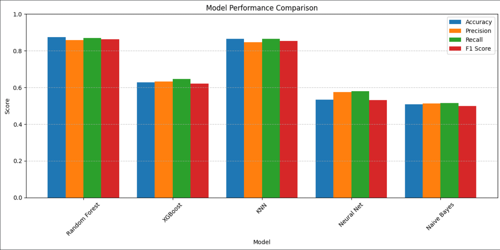
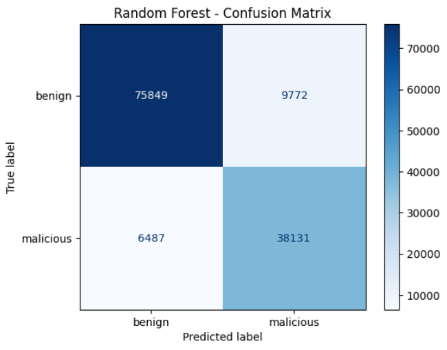
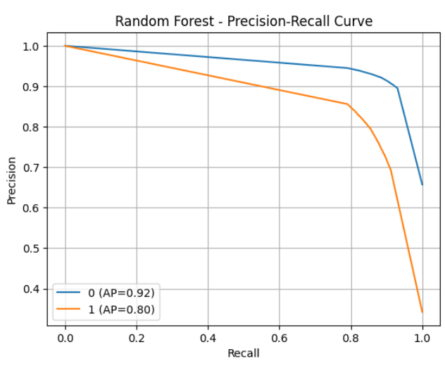
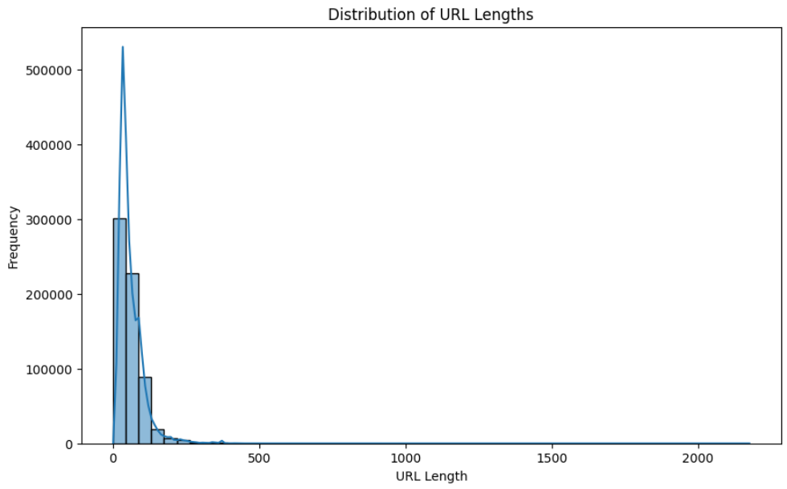
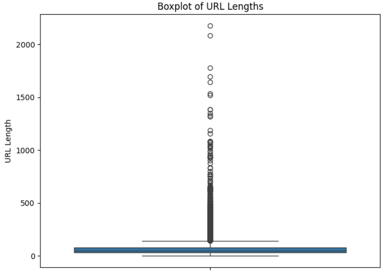
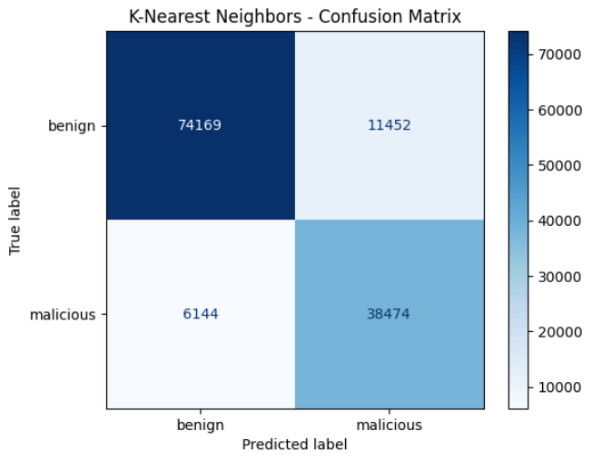

# 🛡 AI-Based Phishing Detection System

Machine Learning | Cybersecurity | Phishing Detection | Python

---

## 📌 Overview

This project demonstrates the implementation of a machine learning-based phishing URL detection system developed using Python and Google Colab. The system was designed to classify phishing and legitimate URLs using multiple machine learning algorithms to support cybersecurity threat detection and analysis.

The project focuses on applying artificial intelligence and machine learning techniques within cybersecurity environments to improve phishing detection capabilities and security awareness.

---

## 👥 Project Context

Originally developed as part of a university group project focused on AI applications in cybersecurity. The machine learning implementation, model evaluation, and project refinement were later independently revisited and enhanced for portfolio and technical development purposes.

---

## 🎯 Objectives

- Detect phishing and malicious URLs using machine learning
- Compare multiple classification algorithms
- Improve cybersecurity threat detection capabilities
- Evaluate model performance using security-focused metrics

---

## 🛠 Technologies Used

- Python
- Google Colab
- Pandas
- NumPy
- Scikit-learn
- XGBoost
- Matplotlib
- Machine Learning Algorithms
- SMOTEENN

---

## 📂 Dataset

The project utilized phishing and legitimate URL datasets commonly used in cybersecurity and machine learning research. The dataset was preprocessed, cleaned, balanced, and prepared for training and evaluation purposes.

---

## ⚙️ Implementation

- Data preprocessing and cleaning
- Feature encoding and normalization
- Dataset balancing using SMOTEENN
- Training and evaluation of multiple machine learning models
- Performance comparison and analysis
- Visualization of model evaluation results

---

## 🤖 Machine Learning Models

- Random Forest
- XGBoost
- K-Nearest Neighbors (KNN)
- Neural Network
- Naive Bayes

---

## 📊 Results

Multiple machine learning models were trained and evaluated using accuracy, precision, recall, and F1-score metrics. Random Forest achieved the best overall performance, reaching approximately 88% accuracy while providing balanced phishing detection capabilities and reliable classification performance.

---

## 🧠 Skills Demonstrated

- Machine Learning for Cybersecurity
- Python Programming
- Threat Detection
- Data Preprocessing
- Security Analytics
- Model Evaluation and Comparison
- Problem Solving and Troubleshooting

---

## 🚀 Future Improvements

- Deploy the system as a web-based phishing detection tool
- Integrate real-time URL scanning capabilities
- Develop a browser extension for phishing detection
- Improve detection accuracy using advanced deep learning models
- Integrate automated alerting and response mechanisms

---

## 📸 Project Visualizations

### Model Performance Comparison

### Random Forest Confusion Matrix

### Random Forest Precision-Recall Curve

### URL Length Distribution

### URL Length Boxplot

### K-Nearest Neighbors (KNN) Confusion Matrix

---

## 📓 Notebook

[Open the Google Colab Notebook](notebook/phishing_detection.ipynb)

---

## 📄 Documentation

Detailed technical documentation and implementation details will be available in the `/docs` folder.
