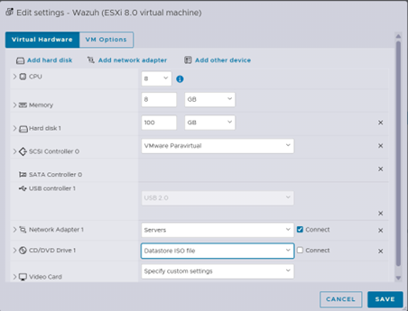
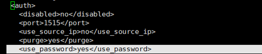
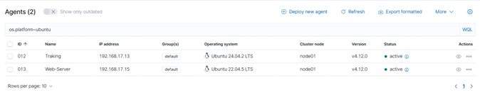
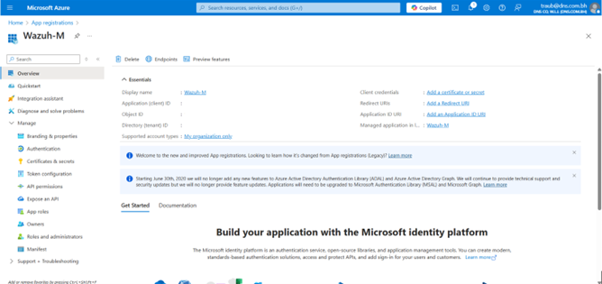
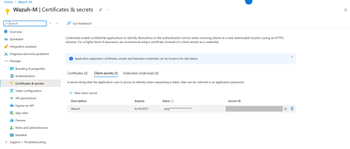
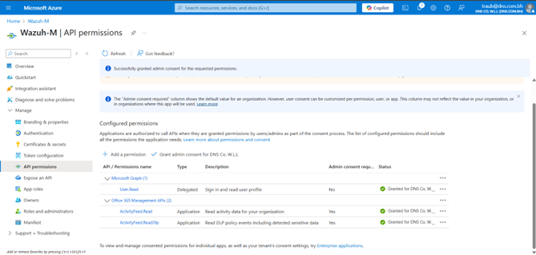
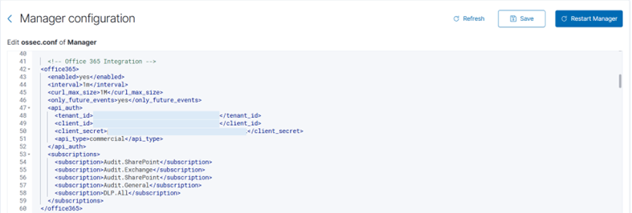
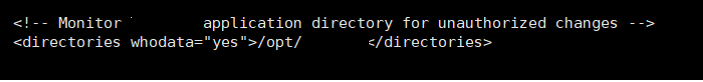
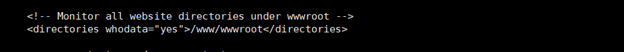

# 🛡 SOC Implementation using Wazuh SIEM

Enterprise-focused Security Information and Event Management (SIEM) implementation using Wazuh for centralized security monitoring, log analysis, endpoint visibility, threat detection, File Integrity Monitoring (FIM), and Office 365 security monitoring.

This project is based on hands-on internship experience involving Wazuh deployment, agent management, centralized monitoring, dashboard engineering, and security event analysis within a controlled enterprise environment.

Sensitive organizational information, infrastructure details, credentials, and internal identifiers have been redacted or excluded for security and privacy purposes.

---

## 🔍 Key Features

- Centralized SIEM deployment using Wazuh
- Windows and Linux agent deployment
- Group Policy Object (GPO) agent deployment
- Office 365 security monitoring integration
- File Integrity Monitoring (FIM)
- Log collection and analysis
- Threat detection and alert monitoring
- Dashboard engineering and visualization
- MITRE ATT&CK monitoring concepts
- Endpoint security monitoring
- Security event analysis and monitoring

---

## 🧪 Environment

### Operating Systems
- Ubuntu Server 24.04 LTS
- Windows Endpoints
- Windows Server
- Linux Servers

### Virtualization
- VMware ESXi

### Security Tools & Platforms
- Wazuh SIEM
- Office 365
- Microsoft Entra ID (Azure AD)
- VMware ESXi
- Windows Group Policy (GPO)

---

## 🏗 Architecture Overview

The environment was designed around a centralized Wazuh Manager responsible for collecting, analyzing, and monitoring logs from multiple Windows and Linux endpoints.

Integrated monitoring components included:
- Windows endpoints
- Windows servers
- Linux application servers
- Linux web servers
- File share servers
- Office 365 audit logs
- File Integrity Monitoring (FIM)

---

## ⚙️ Wazuh Deployment & Configuration

### Wazuh Manager Deployment
- Ubuntu-based Wazuh Manager deployment
- VMware ESXi virtualized environment
- Wazuh installation and upgrade management
- Agent enrollment configuration
- Authentication configuration

### Wazuh Server Environment


### Password-Based Agent Enrollment


### Agent Deployment
- Windows endpoint deployment
- Windows Server deployment
- Linux server integration
- Group Policy Object (GPO) deployment
- Centralized agent management

### Linux Agent Deployment


### Security Monitoring Configuration
- File Integrity Monitoring (FIM)
- Application log monitoring
- Web server log monitoring
- Office 365 audit monitoring
- Threat detection configuration

---

## ☁️ Office 365 Monitoring

Integrated Office 365 monitoring using Azure AD application registration and API permissions to collect:
- Azure Active Directory events
- Exchange activity logs
- SharePoint activity logs
- DLP-related events
- General Office 365 audit activity

### Azure AD Application Registration


### Office 365 Client Secret Configuration


### Office 365 API Permissions


### Office 365 Monitoring Configuration


---

## 🛡 File Integrity Monitoring

### Application Directory Monitoring


### Web Directory Monitoring


---

## 📊 Dashboard Engineering

Custom dashboards were designed to improve visibility across the monitored environment, including:

- Endpoint Security Monitoring
- Threat Detection & Response
- Office 365 Security Monitoring
- File Integrity Monitoring
- Security Alert Overview
- MITRE ATT&CK monitoring concepts

---

## 📘 Documentation

This repository includes:
- Deployment summaries
- Redacted configuration examples
- Monitoring architecture documentation
- Dashboard design summaries
- File Integrity Monitoring configuration
- Office 365 monitoring integration summaries
- Agent deployment documentation
- Lessons learned and operational insights

---

## 📂 Repository Structure

```text
soc-wazuh/
│
├── docs/
├── images/
├── configurations/
├── reports/
├── samples/
└── README.md
```

---

## 🚀 Future Improvements

- Implement advanced active response automation
- Expand endpoint monitoring coverage
- Enhance dashboard visualization
- Integrate additional threat intelligence sources
- Improve automated alert correlation
- Expand MITRE ATT&CK mapping

---

## ⚠ Disclaimer

This project contains redacted and sanitized documentation derived from a real-world internship environment.

All sensitive organizational information, infrastructure details, IP addresses, credentials, tenant identifiers, and internal operational data have been removed, modified, or generalized for security and privacy purposes.

This repository is intended for educational and professional portfolio presentation only.
