# 🛡 Threat Intelligence & Threat Hunting Platform

Threat Intelligence and Threat Hunting platform developed using Wazuh SIEM, Suricata IDS, MISP, VirusTotal, MITRE ATT&CK, and SOAR automation technologies.

This project demonstrates real-world Security Operations Center (SOC) operations including threat detection, intrusion monitoring, threat intelligence integration, cyber attack simulation, incident response, active response automation, and security event correlation across Windows and Linux environments.

Developed as part of an academic cybersecurity project focused on SOC operations, threat intelligence integration, threat hunting, and incident response automation.

---

## 🔍 Key Features

- Centralized SIEM monitoring using Wazuh
- Threat hunting and log analysis
- Suricata IDS integration
- MITRE ATT&CK event mapping
- MISP threat intelligence integration
- VirusTotal malware analysis integration
- File Integrity Monitoring (FIM)
- Vulnerability Detection
- Active Response automation
- SOAR workflow automation using Shuffle
- Simulated cyber attack scenarios
- Incident response playbooks

---

## 🏗 SOC Architecture

The project follows a centralized Security Operations Center (SOC) architecture using Wazuh SIEM, Suricata IDS, threat intelligence integrations, and SOAR automation workflows for threat detection and response.


---

## 📊 Security Monitoring Dashboards

### MITRE ATT&CK Dashboard
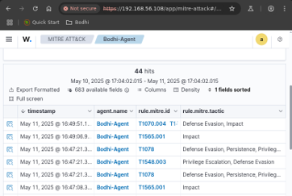

### Vulnerability Detection Dashboard
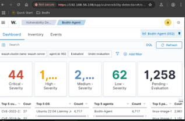

### File Integrity Monitoring Dashboard
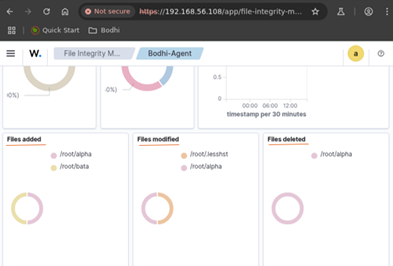

### Threat Hunting Dashboard
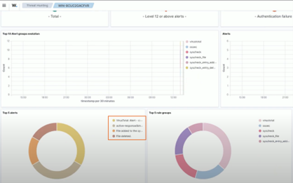

---

## ⚔ Attack Simulations & Detection

### Hydra SSH Brute-Force Attack
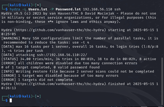

### Nmap SYN Scan
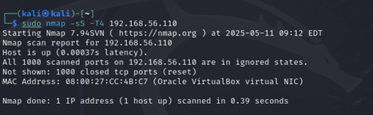

### TCP SYN Flood Attack
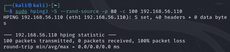

### ICMP Flood Attack
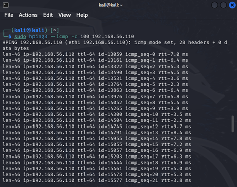

---

## 🚨 Threat Detection & Alerts

### TCP SYN Flood Detection
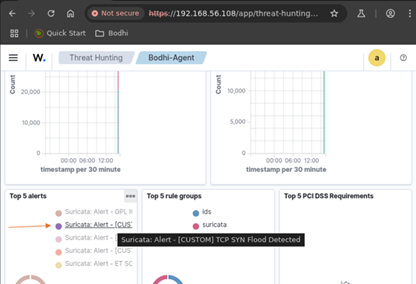

### Nmap Scan Detection
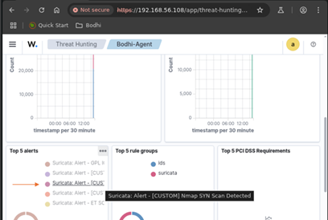

### ICMP Flood Detection
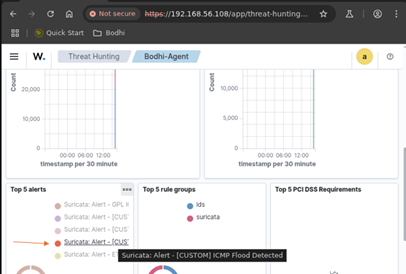

### Firewall-Drop Active Response
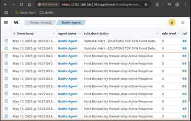

---

## 🔗 Threat Intelligence & Integrations

### Suricata Custom Rules
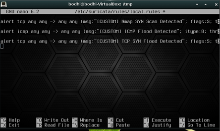

### MISP Integration
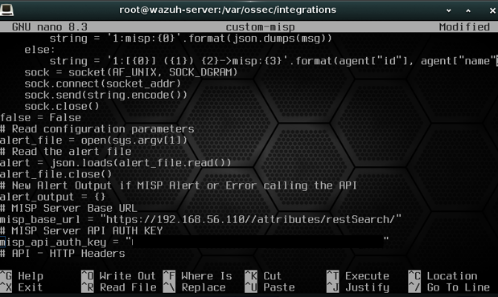

### VirusTotal Integration
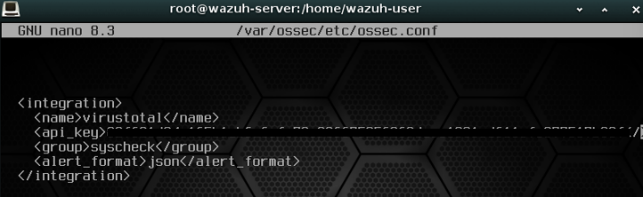

---

## 🤖 SOAR Automation with Shuffle

### Shuffle Workflow
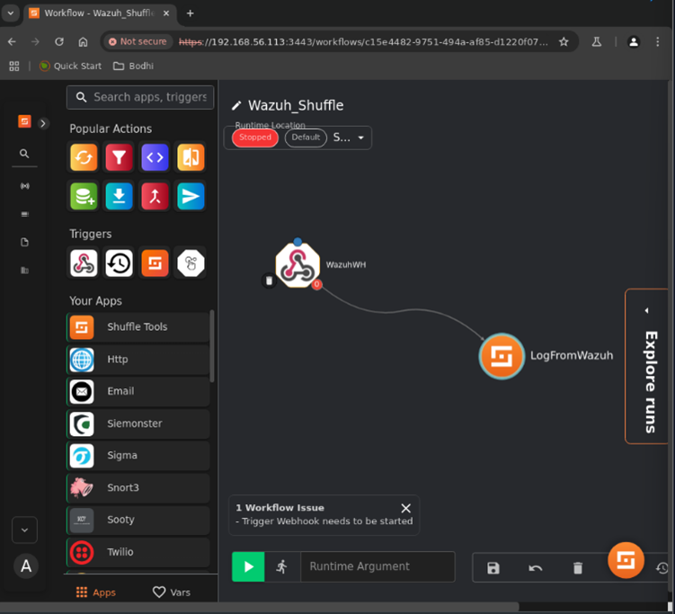

### Shuffle Webhook Integration
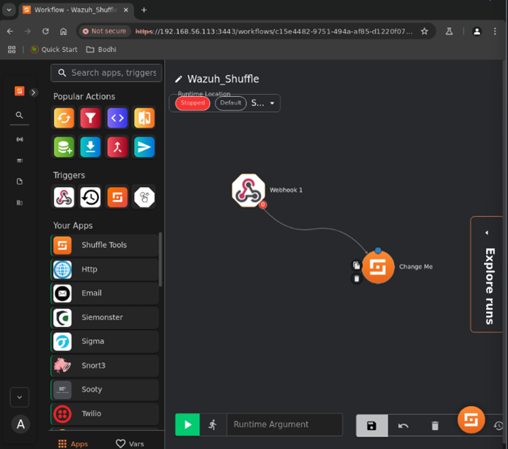

### Automated SSH Alert Handling
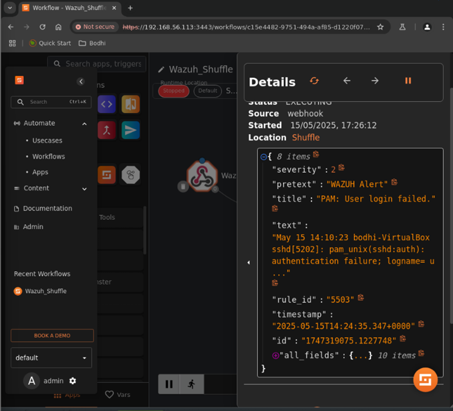

---

## ⚙ Technologies Used

### SIEM & Monitoring
- Wazuh SIEM
- Suricata IDS

### Threat Intelligence
- MISP
- VirusTotal
- MITRE ATT&CK

### SOAR & Automation
- Shuffle SOAR
- Wazuh Active Response

### Operating Systems
- Windows
- Ubuntu Linux
- Bodhi Linux
- Kali Linux

### Security Tools
- Sysmon
- Nmap
- Hydra
- hping3

---

## 📘 Incident Response Playbooks

This repository includes incident response playbooks for handling different cybersecurity incidents, including:

- Phishing Attack Response
- Malware Infection Response
- Brute-Force Attack Response

---

## 📂 Repository Structure

```text
threat-intelligence-and-hunting/
│
├── docs/
├── images/
├── playbooks/
├── rules/
├── samples/
└── README.md
```

---

## 🚀 Future Improvements

- Expand SOAR automation workflows
- Integrate additional threat intelligence feeds
- Enhance dashboard visualizations
- Add Sigma rule support
- Implement automated IOC enrichment
- Deploy containerized SOC lab environment
