# 🛡 Vulnerability Assessment Lab

Hands-on cybersecurity lab focused on vulnerability assessment, penetration testing methodologies, exploitation techniques, and security analysis within a controlled virtual environment.

This project demonstrates practical offensive and defensive cybersecurity concepts including reconnaissance, enumeration, vulnerability scanning, exploitation, privilege escalation, password attacks, SQL injection testing, denial-of-service simulations, and security hardening techniques.

Developed as part of an academic cybersecurity project focused on ethical hacking, vulnerability assessment, penetration testing methodologies, and cybersecurity defense concepts.

---

## 🔍 Key Features

- Network reconnaissance and enumeration
- Vulnerability assessment and analysis
- Nmap network scanning
- Exploitation techniques and attack simulation
- Privilege escalation testing
- Password cracking demonstrations
- SQL Injection testing
- Denial-of-Service (DoS/DDoS) simulations
- Security hardening concepts
- Vulnerability mitigation recommendations
- Hands-on penetration testing and security assessment activities

---

## 🧪 Lab Environment

The lab environment was implemented using isolated virtual machines and controlled cybersecurity testing environments.

### Operating Systems
- Kali Linux
- Ubuntu Linux
- Metasploitable
- Windows Systems

### Virtualization
- VMware
- VirtualBox

### Security Tools
- Nmap
- Metasploit
- Burp Suite
- Wireshark
- SQLMap
- John the Ripper
- hping3

---

## 🌐 Reconnaissance & Enumeration

### Network Discovery
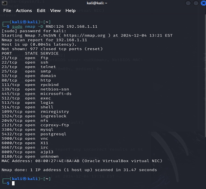

### Service Enumeration
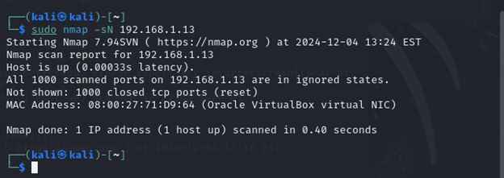

### Operating System Detection
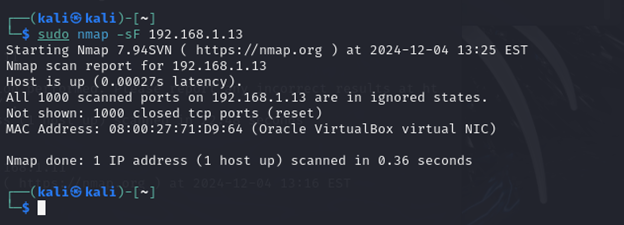

---

## 🔎 Vulnerability Scanning & Assessment

### Port Scanning
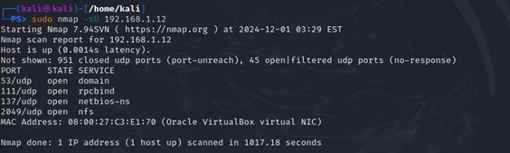

### Nmap Scan Results
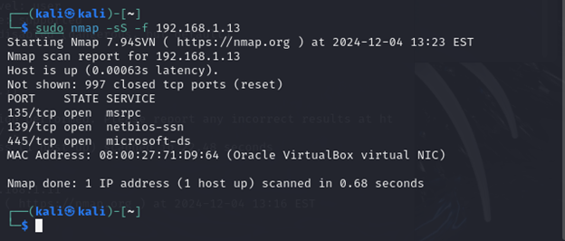

### Vulnerability Scanning
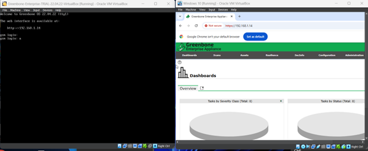

### Vulnerability Findings


### CVE Analysis
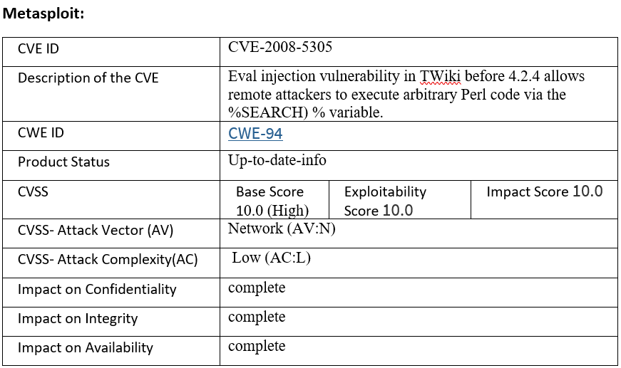

---

## ⚔ Exploitation & Gaining Access

### Metasploit Exploitation
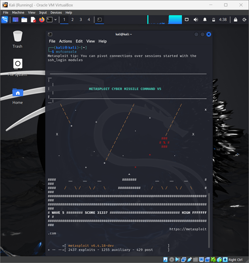

### Successful Remote Session


### Successful Exploitation
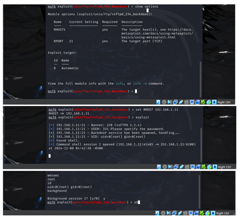

---

## 🔓 Privilege Escalation

### GTFOBins Privilege Escalation
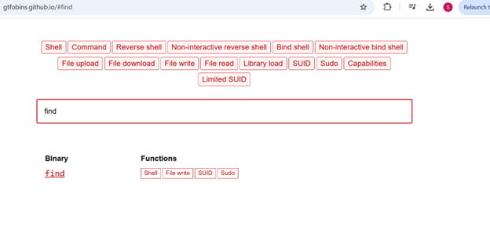

### Privilege Escalation Commands
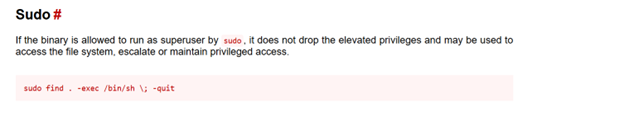

---

## 🚨 Cyber Attack Simulations

### Password Cracking with John the Ripper
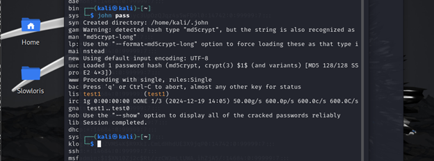

### SQL Injection Testing
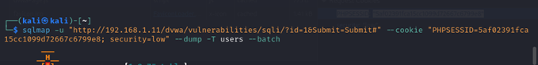

### SQL Database Dump
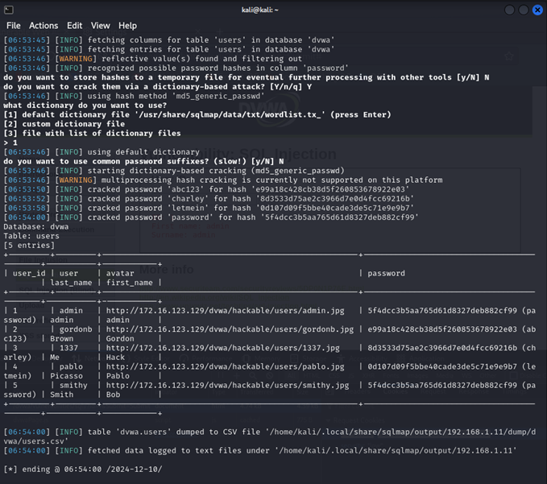

### DoS/DDoS Simulation


### hping3 Flood Attack


---

## 📘 Documentation

This repository includes:
- Vulnerability assessment summaries
- Exploitation documentation
- Security recommendations
- Incident response playbooks
- Remediation guidance
- Scan result summaries
- Security policy references

---

## 📂 Repository Structure

```text
vulnerability-assessment-lab/
│
├── docs/
├── images/
├── playbooks/
├── reports/
├── samples/
└── README.md
```

---

## 🚀 Future Improvements

- Add additional vulnerability scanning tools
- Expand exploitation scenarios
- Integrate automated vulnerability reporting
- Add containerized lab environments
- Enhance attack simulation coverage
- Add security monitoring integration

---

## ⚠ Disclaimer

This project was developed and tested within an isolated lab environment for educational and cybersecurity training purposes only.

All IP addresses, credentials, hostnames, attack simulations, and configurations shown in this repository are non-production and used within controlled virtual environments.

No real-world systems, organizations, or external infrastructure were targeted during the development or testing of this project.
