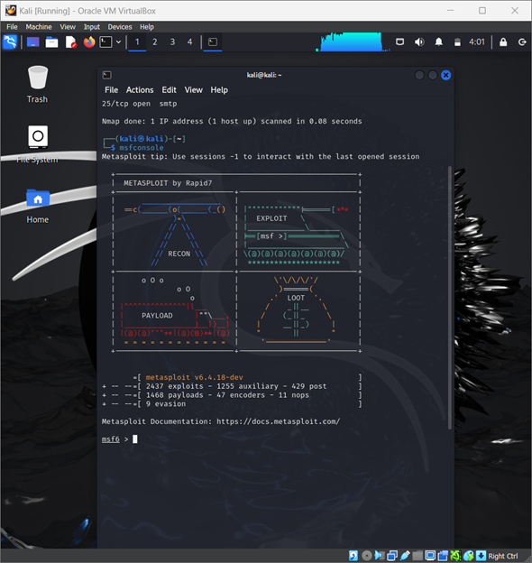
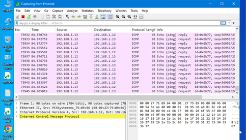

# 🛡 Vulnerability Assessment Lab

Penetration Testing | Vulnerability Assessment | Ethical Hacking | Cybersecurity

---

## 📌 Overview

This project demonstrates the implementation of a controlled vulnerability assessment and penetration testing lab environment using industry-standard cybersecurity tools and methodologies. The project focused on identifying, analyzing, and validating security vulnerabilities within intentionally vulnerable systems in a safe and authorized lab environment.

The assessment included reconnaissance, vulnerability scanning, enumeration, exploitation testing, privilege escalation analysis, password security testing, denial-of-service simulations, post-exploitation activities, and security evaluation exercises to demonstrate practical cybersecurity and ethical hacking concepts.

---

## 🎯 Objectives

- Perform vulnerability assessment and security analysis
- Conduct reconnaissance and enumeration activities
- Identify and validate security vulnerabilities
- Analyze exploitation techniques in controlled environments
- Demonstrate penetration testing methodologies
- Understand attack vectors and mitigation strategies
- Simulate common cybersecurity attack scenarios safely

---

## 🛠 Tools & Technologies

- Kali Linux
- Nmap
- OpenVAS / Greenbone
- Metasploit Framework
- SQLMap
- John the Ripper
- Wireshark
- SET Toolkit
- Hping3
- Netcat
- Linux
- Metasploitable2
- DVWA (Damn Vulnerable Web Application)

---

## ⚙️ Activities Performed

### 🔍 Reconnaissance & Enumeration

- Network discovery and host identification
- TCP/UDP port scanning
- Service enumeration
- FTP, SMTP, and SSL enumeration
- Advanced Nmap scanning techniques

### 🛡 Vulnerability Assessment

- Greenbone/OpenVAS vulnerability scanning
- CVE identification and analysis
- Vulnerability validation
- Security misconfiguration identification

### 💥 Exploitation Testing

- Samba exploitation using Metasploit
- VSFTPD exploitation testing
- SQL Injection testing
- Web application security testing
- Command execution demonstrations

### 🔑 Password Security Testing

- Password hash extraction
- Password cracking using John the Ripper
- Authentication analysis
- Credential testing demonstrations

### 📈 Post-Exploitation & Privilege Escalation

- Shell access validation
- Privilege escalation analysis
- Enumeration using LinEnum
- Persistent access demonstrations
- Access verification and analysis

### 🌐 DoS / DDoS Simulation

- ICMP traffic generation
- SYN flood simulations using Hping3
- Traffic monitoring using Wireshark
- Resource impact observation

### 🎣 Social Engineering Awareness Demonstration

- Credential harvesting simulation
- SET Toolkit phishing awareness demonstration

### 🧹 Covering Tracks Demonstration

- Authentication log analysis
- Log manipulation demonstrations
- Security log inspection

---

## 📊 Key Findings

The vulnerability assessment identified multiple intentionally vulnerable services and security weaknesses within the controlled lab environment. The project demonstrated common attack vectors, insecure configurations, weak authentication mechanisms, privilege escalation opportunities, and exploitable vulnerabilities frequently encountered in cybersecurity testing environments.

The assessment also highlighted the importance of:

- Vulnerability management
- Secure configurations
- Patch management
- Strong authentication practices
- Principle of least privilege
- Continuous security monitoring
- Log monitoring and incident detection

---

## 🧠 Skills Demonstrated

- Vulnerability Assessment
- Penetration Testing Fundamentals
- Linux Administration
- Network Reconnaissance
- Security Analysis
- Threat Identification
- Exploitation Analysis
- Web Application Security Testing
- Password Security Analysis
- Traffic Analysis
- Security Monitoring
- Ethical Hacking Methodologies
- Cybersecurity Reporting

---

## 📸 Project Screenshots

### Reconnaissance & Enumeration

  

  

  

  

  

  

  

  

---

### Vulnerability Scanning

  

  

  

  

  

---

### Metasploit Exploitation

  

  

  

  

  

  

  

  

---

### SQL Injection Testing

  

  

  

  

  

  

---

### Password Cracking

  

  

---

### Samba Exploitation

  

  

---

### Privilege Escalation

  

  

  

  

  

  

  

---

### Post-Exploitation

  

  

  

---

### Maintaining Access

  

  

---

### DoS / DDoS Simulation

  

  

  

  

  

---

### Wireshark Traffic Analysis

  

  

---

### SET Toolkit Demonstration

  

  

  

---

### Covering Tracks Demonstration

  

  

  

---

### Lab Environment

  

  

  

---

## 🚀 Future Improvements

- Expand testing scenarios and lab environments
- Integrate automated vulnerability reporting
- Add advanced web application security assessments
- Improve remediation and reporting workflows
- Simulate enterprise-style security assessment environments
- Integrate SIEM monitoring and alert correlation
- Add Active Directory attack simulations

---

## ⚠️ Disclaimer

This project was conducted in a controlled and authorized lab environment for educational and cybersecurity learning purposes only. No unauthorized systems or real-world environments were targeted.
